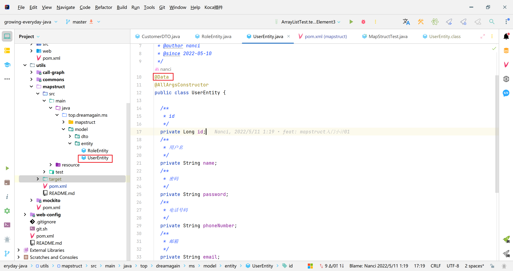
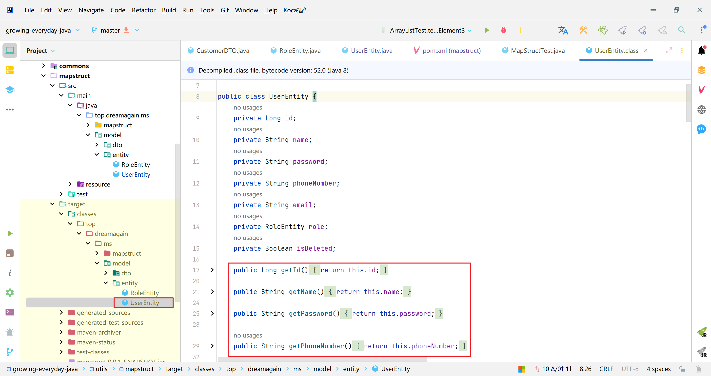

本文内容：
1. `Lombok` & `JSR 269`
2. `Lomobok` 执行流程
3. 模拟 `Lombok`

<!-- more -->

# Lombok的原理

在学习Lombok原理之前有必要先了解一下Java中的规范`JSR 269`，下面就简单的科普一下`JSR`、`JCP`以及`JSR 269`。

‍

## JSR

### **什么是JSR ？**

JSR（Java Specification Requests），是指 Java 规范请求（或者规范提案）。这个请求（提案）是提给 [JCP](https://jcp.org/en/home/index) 的（Java Community Process）。

我们可以从官网上看到所有的 JSR 规范：[https://jcp.org/en/jsr/all](https://jcp.org/en/jsr/all)。

JSR相关的PDF可以从这个仓库中获取：[https://github.com/mercyblitz/jsr](https://github.com/mercyblitz/jsr)。

‍

### 那什么是 JCP 呢？

JCP 是一家专门为 Java 技术开发标准技术规范的组织机构。

任何人都可以在官网上进行注册并参与到审查和提供 Java 规范请求（JSR）的反馈中来，也都可以注册成为 JCP 成员，然后参与 JSR 的专家组，甚至提交自己的 JSR 提案。

‍

### JSR269

Lombok的实现利用了`JSR 269`​中定义的`Pluggable Annotation Processing API`​，即一个注解可以只在编译期有效，它甚至不会被编入class文件。在编译期时，注解处理器把 `Lombok ​`​的注解代码，转换为常规的 Java 方法而实现优雅地编程的。

‍

Java 的编译过程大致可以分为三个阶段：

1. 解析与填充符号表
2. 注解处理
3. 分析与字节码生成

插入式注解处理器的触发点如下图所示：



‍

## @Data原理

我们可以从`@Data`​注解的使用研究一下Lombok是怎么利用`JSR 269`​特性的

‍

### @Data使用案例

在实体类上使用 `@Data`​​​ 进行标注：

​​

编译之后，查看 Person 类的编译源码发现，代码竟然是这样的：

​​

可以看出 Person 类在编译期被注解翻译器修改成了常规的 Java 方法，添加 Getter、Setter、equals、hashCode 等方法。

‍

### Lombok 的执行流程

Lombok 的执行流程如下：



可以看出，在编译期阶段，当 Java 源码被抽象成语法树 (AST) 之后，Lombok 会根据自己的注解处理器动态的修改 AST，增加新的代码 (节点)，在这一切执行之后，再通过分析生成了最终的字节码 (.class) 文件，这就是 Lombok 的执行原理

‍

## 手写一个Lombok

### 工程与环境依赖

#### **配置maven 插件，pom.xml  编译参数**

```xml
<build>
        <plugins>
            <plugin>
                <groupId>org.apache.maven.plugins</groupId>
                <artifactId>maven-compiler-plugin</artifactId>
                <version>3.8.0</version>
                <configuration>
                    <source>8</source>
                    <target>8</target>
                    <encoding>UTF-8</encoding>
                    <compilerArgs>
                        <arg>-parameters</arg>
                        <arg>-proc:none</arg>
                        <arg>-XDignore.symbol.file</arg>
                    </compilerArgs>
                    <compilerArguments>
                        <bootclasspath>
                            ${java.home}/lib/rt.jar${path.separator}${java.home}/lib/jce.jar${path.separator}${java.home}/../lib/tools.jar
                        </bootclasspath>
                    </compilerArguments>
                    <fork>true</fork>
                </configuration>
            </plugin>
        </plugins>
    </build>
```

#### 注意细节

1. Lombok项目本身要加编译参数 ，防止编译处理器无法实例化：-proc:none
2. 要添加编译类路径 bootclasspath： 指定tool.jar
3. 在测试的时候 要构建一个新的工程，用一个新的IDEA窗口打开

### 注解处理器

1. 编写注解处理器,实现`AbstractProcessor`​
2. 基于SPI指定处理器的路径 ：工程/resources/META-INF/services/javax.annotation.processing.Processor
3. 打印消息的时候，maven 用System.out,  idea用`Messager`​ 类

```java
@SupportedSourceVersion(SourceVersion.RELEASE_8)
@SupportedAnnotationTypes("org.myLombok.Hello")
public class HelloProcessor  extends AbstractProcessor {
    @Override
    public synchronized void init(ProcessingEnvironment processingEnv) {
        System.out.println("这是我的第一人编译注释处理器");
        processingEnv.getMessager().printMessage(Diagnostic.Kind.NOTE,"这是我的处理器");
    }

    @Override
    public boolean process(Set<? extends TypeElement> annotations, RoundEnvironment roundEnv) {
        return false;
    }
}
```

‍

### JCTree 修改语法

构建一个hello world 语句

```java
package org.myLombok;
/**
 * @Copyright 源码阅读网 http://coderead.cn
 */

import com.sun.tools.javac.api.JavacTrees;
import com.sun.tools.javac.processing.JavacProcessingEnvironment;
import com.sun.tools.javac.tree.JCTree;
import com.sun.tools.javac.tree.TreeMaker;
import com.sun.tools.javac.tree.TreeTranslator;
import com.sun.tools.javac.util.Context;
import com.sun.tools.javac.util.List;
import com.sun.tools.javac.util.Names;

import javax.annotation.processing.*;
import javax.lang.model.SourceVersion;
import javax.lang.model.element.TypeElement;
import javax.tools.Diagnostic;
import java.util.Set;

/**
 * @author 鲁班大叔
 * @date 2023
 */
@SupportedSourceVersion(SourceVersion.RELEASE_8)
@SupportedAnnotationTypes("org.myLombok.Hello")
public class HelloProcessor  extends AbstractProcessor {
    private JavacTrees javacTrees; // 获取 JCTree
    private TreeMaker treeMaker; // 构建生成 JCTree
    private Names names;

    @Override
    public synchronized void init(ProcessingEnvironment processingEnv) {
        System.out.println("这是我的第一人编译注释处理器");
        processingEnv.getMessager().printMessage(Diagnostic.Kind.NOTE,"这是我的处理器");
        javacTrees = JavacTrees.instance(processingEnv);// 语法树
        Context context = ((JavacProcessingEnvironment) processingEnv).getContext();
        this.treeMaker = TreeMaker.instance(context);
        super.init(processingEnv);
        this.names = Names.instance(context);

    }

    @Override
    public boolean process(Set<? extends TypeElement> annotations, RoundEnvironment roundEnv) {
        annotations.stream()
                .flatMap(t->roundEnv.getElementsAnnotatedWith(t).stream())
                .forEach(t->{
                    JCTree tree = javacTrees.getTree(t);
                 // 基于访问者设计模式 去修改方法
                    tree.accept(new TreeTranslator(){
                        @Override
                        public void visitMethodDef(JCTree.JCMethodDecl tree) {
                            // System.out.println("hello world");
                            JCTree.JCStatement sysout = treeMaker.Exec(
                                    treeMaker.Apply(
                                            List.nil(),
                                            select("System.out.println"),
                                            List.of(treeMaker.Literal("hello world!")) // 方法中的内容
                                    )
                            );
                            // 覆盖原有的语句块
                            tree.body.stats=tree.body.stats.append(sysout);
                            super.visitMethodDef(tree);
                        }
                    });
                });

        return true;
    }


    private JCTree.JCFieldAccess select(JCTree.JCExpression selected, String expressive) {
        return treeMaker.Select(selected, names.fromString(expressive));
    }

    private JCTree.JCFieldAccess select(String expressive) {
        String[] exps = expressive.split("\\.");
        JCTree.JCFieldAccess access = treeMaker.Select(ident(exps[0]), names.fromString(exps[1]));
        int index = 2;
        while (index < exps.length) {
            access = treeMaker.Select(access, names.fromString(exps[index++]));
        }
        return access;
    }

    private JCTree.JCIdent ident(String name) {
        return treeMaker.Ident(names.fromString(name));
    }
}

```

‍
